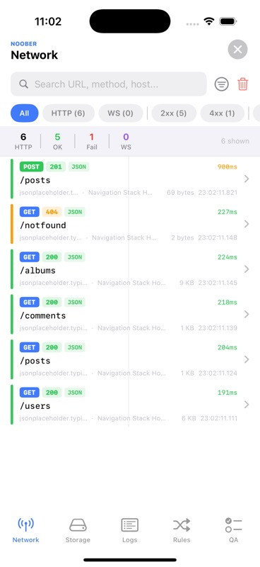
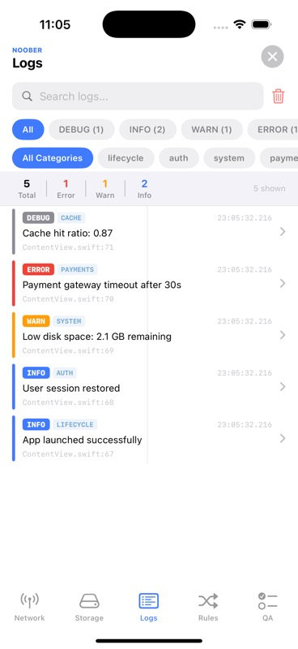
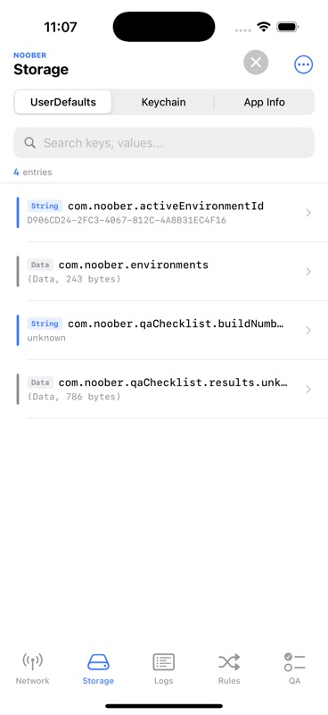
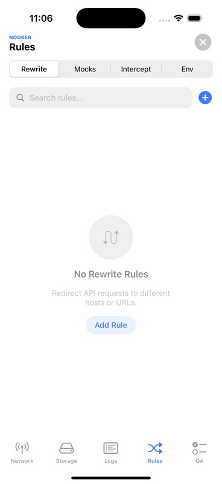
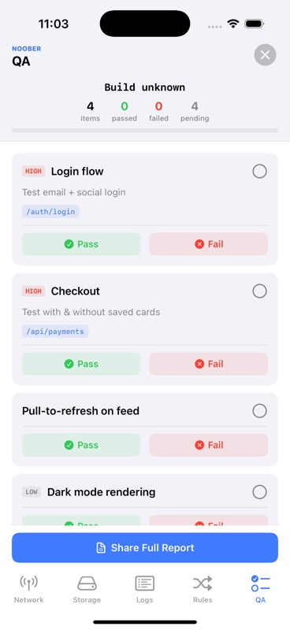

# Noober

A powerful, zero-dependency debugging toolkit for iOS apps.

[](https://swift.org)
[](https://developer.apple.com/ios/)
[](https://swift.org/package-manager/)
[](LICENSE)
[](https://noob-programmer1.github.io/Noober-iOS/documentation/noober/)

Noober gives your debug builds a floating inspector bubble that lets you monitor network traffic, inspect storage, view logs, define mock/rewrite/intercept rules, switch environments, and run QA checklists — all without leaving your app.

**[Documentation](https://noob-programmer1.github.io/Noober-iOS/documentation/noober/)**

<p align="center">
  
  
  
  
  
</p>

---

## Features

### Network Inspector
- **Automatic HTTP/HTTPS capture** — intercepts all `URLSession` traffic (default & ephemeral configs) via `URLProtocol` swizzling. Zero setup.
- **WebSocket monitoring** — tracks WebSocket connections, sent/received frames, ping/pong, close codes, and payload previews.
- **Rich detail view** — method, status code, URL, headers, request/response body (with JSON pretty-printing), timing, and content size.
- **cURL export** — copy any captured request as a ready-to-paste cURL command.
- **Request replay** — re-fire any captured request with one tap.
- **Image preview** — inline image rendering for image responses.
- **Screen tracking** — automatically tags each request with the view controller that triggered it. Group requests by screen.
- **Search & filter** — filter by HTTP method, status code, host, content type, entry type (HTTP/WebSocket), or source screen.

### Rules Engine
- **URL rewrite rules** — redirect requests to different hosts at runtime (e.g., production to staging). Supports match modes: Host, Contains, Prefix, Exact, and Regex.
- **Mock rules** — return synthetic responses without hitting the network. Configure status code, headers, and response body per rule.
- **Intercept rules** — pause matching requests mid-flight and present them for inspection. Edit the URL, method, headers, or body before proceeding, proceed with the original, or cancel. Auto-timeout after 60 seconds.
- **Persistent** — all rules are saved to UserDefaults and survive app restarts.

### Environment Switching
- **Register environments** — define named environments with base URLs and optional notes.
- **One-tap switching** — switch the active environment from the debug panel. All matching network requests are rewritten automatically.
- **Multi-URL support** — map multiple base URLs positionally between environments (e.g., API server + CDN + WebSocket host).
- **Persistent selection** — the active environment is remembered across launches.

### QA Checklist
- **Register test items** — define checklist items with title, notes, priority (high/normal/low), and associated API endpoints.
- **Track pass/fail** — mark items as passed, failed (with notes and attached request IDs), or reset to pending.
- **Build-aware** — checklist state is keyed by build number. A new build auto-resets the checklist while preserving item definitions.
- **Progress overview** — see counts of passed, failed, and pending items at a glance.
- **Fail reports** — attach network requests to failed items for context.

### Storage Inspector
- **UserDefaults browser** — view, edit, delete, and duplicate UserDefaults entries. Type-aware editing (String, Int, Double, Bool, Date, Array, Dictionary). Export as JSON. Toggle system keys visibility.
- **Keychain browser** — list generic and internet password items. Lazy-load values on demand. Add, edit, and delete entries.
- **App info** — bundle version, build number, and storage details.

### Custom Logging
- **Structured logs** — log with message, level (`debug`, `info`, `warning`, `error`), and custom category.
- **Source location** — each log records the file and line number automatically.
- **Filter by level & category** — narrow down logs in the UI.
- **Thread-safe** — `log()` is `nonisolated` and safe to call from any thread.

### Floating Bubble UI
- **Draggable bubble** — a floating overlay bubble that snaps to screen edges. Tap to open the full debug panel.
- **Live activity indicator** — shows active request count with a rotating spinner. Pulse animations on success (green) and failure (red).
- **5-tab debug panel** — Network, Storage, Logs, Rules, QA.
- **Global search** — search across all tabs.
- **Haptic feedback** — tactile responses for interactions.
- **Non-intrusive** — the bubble passes through touches outside its bounds so your app works normally.

### Developer Experience
- **Zero dependencies** — pure Swift, no third-party libraries.
- **One-line setup** — `Noober.shared.start()` is all you need.
- **Swift 6 concurrency** — `@MainActor` stores, `nonisolated` logging, `Sendable` models.
- **Thread-safe** — `os_unfair_lock` for screen tracking, `NSLock` for rule snapshots, actor isolation for stores.
- **Auto-cleanup** — max 500 HTTP requests, 500 logs, 1000 WebSocket frames per connection, 200 screen history entries.

---

## Installation

### Swift Package Manager

**Xcode:**

1. Go to **File > Add Package Dependencies**
2. Enter the repository URL:
   ```
   https://github.com/noob-programmer1/Noober-iOS.git
   ```
3. Select **Up to Next Major** from `2.0.0`

**Package.swift:**

```swift
dependencies: [
    .package(url: "https://github.com/noob-programmer1/Noober-iOS.git", from: "2.0.0")
]
```

Then add `"Noober"` to your target's dependencies:

```swift
.target(
    name: "YourApp",
    dependencies: ["Noober"]
)
```

---

## Quick Start

> [!WARNING]
> Noober is a debugging tool. Always wrap usage with `#if DEBUG` to exclude it from release builds.

### Basic Setup

```swift
#if DEBUG
import Noober
#endif

@main
struct MyApp: App {
    init() {
        #if DEBUG
        Noober.shared.start()
        #endif
    }

    var body: some Scene {
        WindowGroup { ContentView() }
    }
}
```

That's it. Tap the floating bubble to open the debug panel.

### Full Setup

```swift
#if DEBUG
import Noober
#endif

@main
struct MyApp: App {
    init() {
        #if DEBUG
        // Register environments for quick switching
        Noober.shared.registerEnvironments([
            .init(name: "Production", baseURL: "https://api.example.com"),
            .init(name: "Staging",
                  baseURL: "https://api.staging.example.com",
                  notes: "Uses test payment keys"),
            .init(name: "Local",
                  baseURL: "http://localhost:8080",
                  notes: "Run the dev server first"),
        ])

        // Register a QA checklist for the current build
        Noober.shared.registerChecklist([
            .init("Login flow",
                  notes: "Test with email + social login",
                  priority: .high,
                  endpoints: ["/auth/login", "/auth/social"]),
            .init("Checkout",
                  notes: "Test with & without saved cards",
                  priority: .high,
                  endpoints: ["/api/payments"]),
            .init("Pull-to-refresh on feed",
                  priority: .normal),
        ])

        Noober.shared.start()
        #endif
    }

    var body: some Scene {
        WindowGroup { ContentView() }
    }
}
```

### Custom Logging

```swift
#if DEBUG
// Basic log
Noober.shared.log("User signed in")

// With level and category
Noober.shared.log("Payment initiated", level: .info, category: .init("payments"))
Noober.shared.log("Token refresh failed", level: .error, category: .init("auth"))
Noober.shared.log("Cache miss for key: user_profile", level: .debug, category: .init("cache"))
#endif
```

### Stopping Noober

```swift
#if DEBUG
Noober.shared.stop()  // Removes bubble, clears all data, uninstalls interceptors
#endif
```

---

## API Reference

### Core

| Method | Description |
|--------|-------------|
| `Noober.shared.start()` | Install interceptors, show floating bubble, begin capturing |
| `Noober.shared.stop()` | Uninstall interceptors, hide bubble, clear all captured data |
| `Noober.shared.isStarted` | Whether Noober is currently running |

### Logging

| Method | Description |
|--------|-------------|
| `Noober.shared.log(_:level:category:file:line:)` | Add a log entry. Thread-safe (`nonisolated`). |

**Log Levels:** `debug`, `info`, `warning`, `error`

**Log Categories:** Create custom categories with `LogCategory("analytics")`. Built-in: `.general`.

### Environments

| Method | Description |
|--------|-------------|
| `Noober.shared.registerEnvironments(_:)` | Register available environments. First is the default (no rewriting). |

### QA Checklist

| Method | Description |
|--------|-------------|
| `Noober.shared.registerChecklist(_:)` | Register QA checklist items for the current build. |

**Priority Levels:** `.high`, `.normal`, `.low`

---

## Documentation

Full API documentation is available at:

**[noob-programmer1.github.io/Noober-iOS](https://noob-programmer1.github.io/Noober-iOS/documentation/noober/)**

### How the documentation is built and deployed

The documentation is built using [Swift-DocC](https://www.swift.org/documentation/docc/) and hosted on GitHub Pages from the `gh-pages` branch.

**DocC Catalog:** The source lives in `Sources/Noober/Noober.docc/` — a documentation catalog containing article pages (Getting Started, Network Inspector, Rules Engine, etc.) alongside the auto-generated API reference from `///` doc comments in the source code.

**Build locally:**

```bash
# 1. Build the DocC archive
xcodebuild docbuild \
  -scheme Noober \
  -destination 'generic/platform=iOS' \
  -derivedDataPath .derivedData

# 2. Transform for static hosting
$(xcrun --find docc) process-archive \
  transform-for-static-hosting \
  .derivedData/Build/Products/Debug-iphoneos/Noober.doccarchive \
  --hosting-base-path Noober-iOS \
  --output-path docs
```

**Deploy:** The `docs/` output is pushed to the `gh-pages` branch. GitHub Pages serves it as a static site. A `.nojekyll` file in the branch root tells GitHub to skip Jekyll processing (required for DocC's SPA routing to work).

---

## Architecture

```
Sources/Noober/
├── Noober.swift                    # Public API singleton
├── Core/
│   ├── FloatingBubbleView.swift    # Draggable overlay bubble with pulse animations
│   └── NooberWindow.swift          # Overlay window management (bubble + debugger)
├── Network/
│   ├── NetworkInterceptor.swift    # URLProtocol-based HTTP/HTTPS interception
│   ├── NetworkInterceptor+Swizzle.swift  # URLSessionConfiguration swizzling
│   ├── NetworkActivityStore.swift  # Request/WebSocket storage (max 500/1000)
│   ├── RequestReplayer.swift       # Re-fire captured requests
│   ├── ScreenTracker.swift         # UIViewController tracking via swizzle
│   └── Models/
│       └── NetworkRequestModel.swift
├── WebSocket/
│   ├── WebSocketInterceptor.swift  # WebSocket frame capture via swizzle
│   └── Models/
│       └── WebSocketModels.swift
├── Rules/
│   ├── RulesStore.swift            # Persistent rule CRUD
│   ├── InterceptManager.swift      # Pending intercept lifecycle
│   └── Models/
│       ├── URLMatchPattern.swift   # Host/Contains/Prefix/Exact/Regex matching
│       ├── URLRewriteRule.swift    # URL rewrite definitions
│       ├── MockRule.swift          # Mock response definitions
│       ├── InterceptRule.swift     # Request intercept definitions
│       └── PendingIntercept.swift  # In-flight intercepted request state
├── Environment/
│   ├── EnvironmentStore.swift      # Persistent environment switching
│   └── NooberEnvironment.swift     # Environment model
├── QAChecklist/
│   ├── QAChecklistStore.swift      # Build-keyed checklist persistence
│   └── Models/
│       └── QAChecklistItem.swift
├── Logs/
│   ├── LogStore.swift              # Log entry storage (max 500)
│   └── Models/
│       └── LogEntry.swift          # Level, category, message, file, line
├── UserDefaults/
│   ├── UserDefaultsStore.swift     # UserDefaults CRUD + export
│   └── Models/
│       └── UserDefaultsEntry.swift
├── Keychain/
│   ├── KeychainStore.swift         # Keychain item CRUD
│   └── Models/
│       └── KeychainEntry.swift
└── UI/                             # SwiftUI debug panel (5 tabs)
    ├── NooberMainView.swift
    ├── Network/
    ├── Storage/
    ├── Logs/
    ├── Rules/
    ├── QAChecklist/
    ├── Keychain/
    ├── UserDefaults/
    └── Shared/                     # Theme, badges, search bar, JSON flattener
```

---

## Requirements

- iOS 15.0+
- Swift 6.0+
- Xcode 16+

---

## License

```
Copyright 2023 Abhishek Agarwal

Licensed under the Apache License, Version 2.0 (the "License");
you may not use this file except in compliance with the License.
You may obtain a copy of the License at

    http://www.apache.org/licenses/LICENSE-2.0

Unless required by applicable law or agreed to in writing, software
distributed under the License is distributed on an "AS IS" BASIS,
WITHOUT WARRANTIES OR CONDITIONS OF ANY KIND, either express or implied.
See the License for the specific language governing permissions and
limitations under the License.
```
